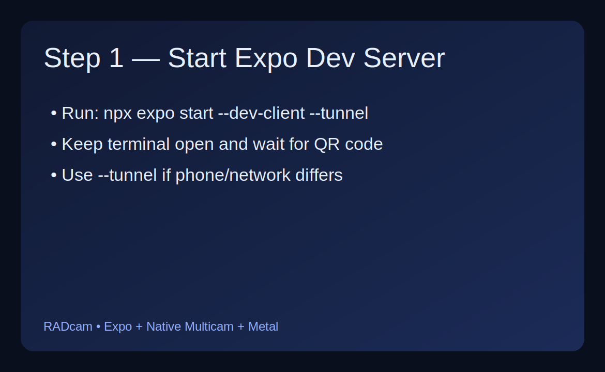
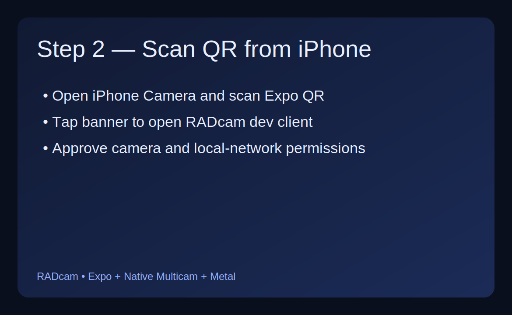
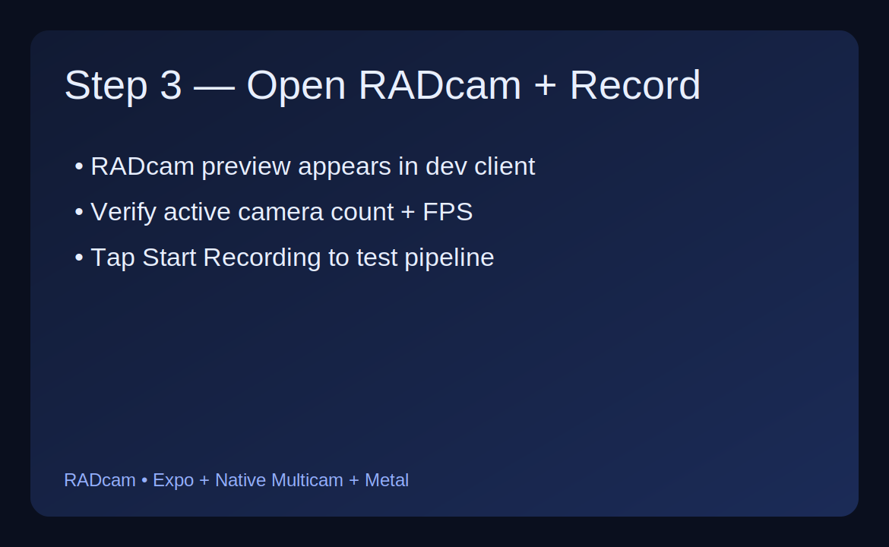

# RADcam

RADcam is an open-source Expo + React Native iOS project that demonstrates synchronized rear-camera capture with **AVCaptureMultiCamSession**, real-time **Metal compute** processing, and RadSplat-style radial preview rendering.

> No binary artifacts are included. All camera, rendering, and bridge logic is in readable Swift, Metal, and TypeScript source.

## Features

- Rear camera capability detection (single / dual / multicam fallback)
- AVCaptureMultiCamSession capture graph for synchronized frame ingestion
- Zero-copy CVPixelBuffer ➜ Metal texture conversion using `CVMetalTextureCache`
- Metal compute shaders for radial splatting + compositing (`.metal` source)
- Live preview streamed into an Expo Module native view
- Recording pipeline via AVAssetWriter (`HEVC` / `H264`)
- Expo-compatible React Native UI in TypeScript

## Repository layout

```text
.
├── App.tsx
├── app.json
├── modules/
│   └── radcam-multicam/
│       ├── expo-module.config.json
│       ├── ios/
│       │   ├── CameraCapabilities.swift
│       │   ├── MultiCamManager.swift
│       │   ├── RadcamMulticamModule.swift
│       │   ├── RadcamPreviewView.swift
│       │   ├── RadSplatRenderer.swift
│       │   ├── RadSplatShaders.metal
│       │   └── VideoEncoder.swift
│       ├── package.json
│       ├── radcam-multicam.podspec
│       └── src/
│           ├── RadcamMulticamModule.ts
│           ├── RadcamMulticam.types.ts
│           └── index.ts
├── scripts/
│   ├── bootstrap.sh
│   └── run-ios.sh
└── src/
    ├── components/CameraScreen.tsx
    ├── hooks/useRadcam.ts
    └── native/RadcamMulticamModule.ts
```

## Architecture

### 1) Capture Layer (AVFoundation)

`MultiCamManager` builds a multi-input/multi-output session with one video output per rear lens (wide, ultra-wide, telephoto where available). The manager automatically selects the best mode:

- `multi`: up to three rear streams when `AVCaptureMultiCamSession.isMultiCamSupported`
- `dual`: first two rear streams
- `single`: first rear stream

### 2) Processing Layer (Metal texture pipeline)

For each incoming sample buffer:

1. Extract `CVPixelBuffer`
2. Convert to `MTLTexture` through `CVMetalTextureCache`
3. Send textures to compute kernels without CPU pixel copies

### 3) Renderer Layer (RadSplat)

`RadSplatShaders.metal` applies a radial warp + glow accumulation (`radialSplatKernel`) and post composite (`compositeKernel`) to produce a single stylized preview texture.

### 4) Encoding Layer (AVAssetWriter)

`VideoEncoder` creates `.mov` output with real-time `AVAssetWriterInputPixelBufferAdaptor` and supports:

- `hevc` (default)
- `h264`

### 5) Bridge Layer (Expo Modules API)

`RadcamMulticamModule.swift` exposes async APIs to JS:

- `getCapabilitiesAsync`
- `startSessionAsync` / `stopSessionAsync`
- `startRecordingAsync` / `stopRecordingAsync`

`RadcamPreviewView` renders Metal output inside a native view and emits frame metrics (`fps`, `activeCameras`) to React Native.

## Prerequisites

- macOS with Xcode 15+
- Node.js 18+
- CocoaPods (installed with Xcode toolchain)
- A real iOS device that supports requested camera mode (recommended)

## Quick start

```bash
npm install
npx expo prebuild --clean
npx expo run:ios --device
```

or run the helper script:

```bash
npm run bootstrap
npm run run:ios
```

## Run on iPhone via QR code (dev client workflow)

Because RADcam includes native Swift/Metal code, it cannot run in Expo Go. Use an Expo development build and then launch through a QR code:

1. Build/install the dev client once:

```bash
npx expo prebuild --clean
npx expo run:ios --device
```

2. Start the Metro server and generate a QR code:

```bash
npx expo start --dev-client --tunnel
```

3. On your iPhone, scan the QR code with Camera and tap the banner to open RADcam in the installed dev client.

### QR setup screenshots

#### Step 1: Start the Expo dev server


#### Step 2: Scan the QR code on iPhone


#### Step 3: Open RADcam and verify preview/recording


## Build and run details

1. Install dependencies.
2. Prebuild the Expo iOS project (generates `/ios`).
3. Build a development client and deploy to a connected device.
4. Grant camera permission on first launch.
5. Press **Start Recording** to capture RadSplat-stylized session output.

## Extending the renderer

- Add new Metal kernels in `modules/radcam-multicam/ios/RadSplatShaders.metal`
- Register additional compute pipelines in `RadSplatRenderer.swift`
- Wire parameters/events through `RadcamMulticamModule.swift` and TS bindings

Potential additions:

- per-lens calibration and distortion model uniforms
- temporal denoising kernel
- depth-aware compositing (LiDAR-capable devices)
- RTMP/WebRTC live stream output path

## Important notes

- iOS multi-camera performance depends on thermal and hardware limits.
- The sample currently writes one composited stream to disk for simplicity.
- If your device cannot run full multicam, the app automatically falls back to dual/single mode.

## License

MIT
